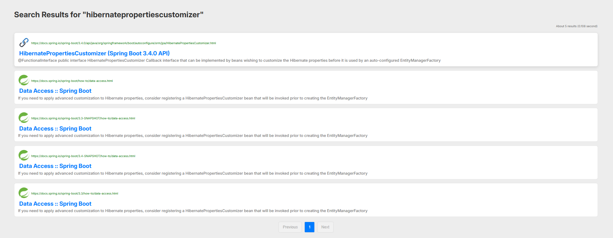

this repo created for learning how web search engine such as google work and write some project with crawler and other concept of search engine

----------------------

🤩🤩🤩  .Wow we are implement lightweight web search engine same as <b style="color:blue">G</b><b style="color:red">o</b><b style="color:orange">o</b><b style="color:blue">g</b><b style="color:green">l</b><b style="color:red">e</b> 

## general overview of implementation of web search engine with elastic search  

we implemented web search engine with elastic.  
😎😎 in next version we want to implement key functionality of elastic instead of using it. 
.
### get started with project

it's very easy to run that

1) <b>install Docker from official page</b>
2) use following command for start in <b>development mode</b> . open <b>powershell</b> or <b>git-bash</b> 
            
       chmod +x start-development-services.sh
       bash start-development-services.sh

2) its amazing all services and dependency installed and configured properly
--------------------------------------------------

after run all service & dependency for project to work correctly
we need two thing

1) add domain with crawler-service to crawler that domain and related page .and automatically index that in search-service from crawled webpage

we do it manually from swagger . but we can generate ui for that and only admin user can do that   
it accessible at http://localhost:8080/swagger-ui/index.html

2) you access to all document generated from start point of <b>crawler-service</b> in <b>kibana dashboard</b>
    at address(http://localhost:5601) by <i>username -> <b>elastic</b> & password -> <b>123456</b> </i> .  

it has amazing visualization dashboard like bellow

3) also using search-service endpoint at (http://localhost:8083/swagger-ui/index.html)   to retrieve clear result for <b>suggestion & search</b> that read from elastic index  

we fortunately create ui for show suggestion and search from search-service same as <b style="color:blue">G</b><b style="color:red">o</b><b style="color:orange">o</b><b style="color:blue">g</b><b style="color:green">l</b><b style="color:red">e</b> .  it accessible at http://localhost:3000

i generate ui for autocomplete in search-box and select that. like picture bellow  

-----------------------------------------------------------------

and after select input we search base on query to find most related document and rank them. like picture bellow

 
over time our dataset is larger and our suggestion it can be more precise and search result is more
